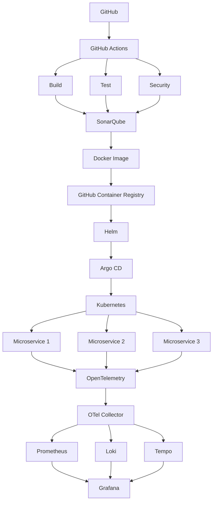

# Backend Development

- Java 21
- Spring Boot 4.x
- Spring Web
- Spring Data JPA
- Spring Security
- Spring Cloud
- REST APIs
- Microservices Architecture
- Gradle
- JUnit 5
- Mockito
- Testcontainers

# Complete

```text
                              GitHub
                                │
                                ▼
                        GitHub Actions
                                │
              ┌─────────────────┼─────────────────┐
              │                 │                 │
              ▼                 ▼                 ▼
            Build            Test           Security
              │                 │                 │
              └─────────────────┼─────────────────┘
                                │
                                ▼
                            SonarQube
                                │
                                ▼
                          Docker Image
                                │
                                ▼
                    GitHub Container Registry
                                │
                                ▼
                              Helm
                                │
                                ▼
                            Argo CD
                                │
                                ▼
                          Kubernetes
                                │
              ┌─────────────────┼─────────────────┐
              │                 │                 │
              ▼                 ▼                 ▼
        Microservice     Microservice     Microservice
              │                 │                 │
              └─────────────────┼─────────────────┘
                                │
                                ▼
                         OpenTelemetry
                                │
                          OTel Collector
                                │
              ┌─────────────────┼─────────────────┐
              │                 │                 │
              ▼                 ▼                 ▼
          Prometheus          Loki            Tempo
              │                 │                 │
              └─────────────────┼─────────────────┘
                                │
                                ▼
                             Grafana
```

